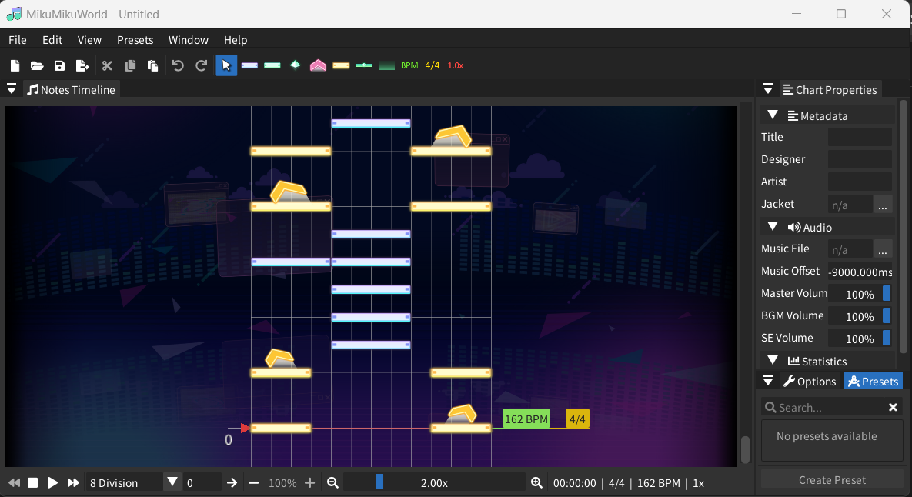
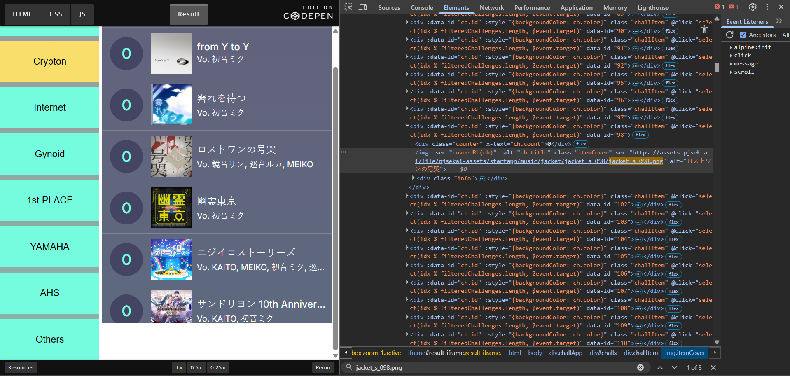
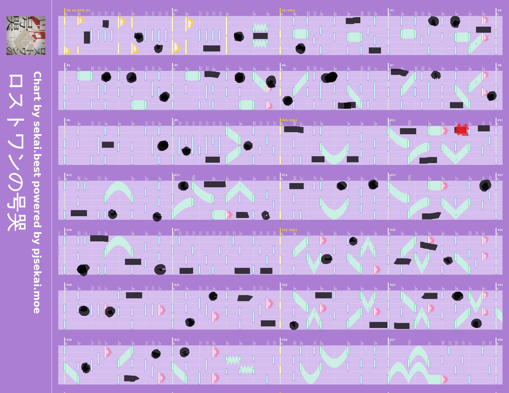

# HCMUS-CTF Qual 2025

## Forensic

### TLS Challenge (88 solves/101 points)

```
Can you extract the flag from encrypted HTTPS?
```

Áp dụng khóa SSL vào trong Wireshark để giải mã các gói tin TLS, tìm flag trong các stream HTTP sau khi giải mã.

### Trashbin (88 solves/101 points)

```
Someone’s been treating my computer like a trash bin, constantly dumping useless files into it. But it seems he got careless and dropped a really important one in there. Even though he deleted it afterward, it might have been too late—hehe😏.
```

Trích xuất toàn bộ file trong SMB, giải nén hết tất cả và tìm flag bằng `strings` và `grep`


### Disk Partition (82 solves/106 points)

```
Too many flags... but only one is real.
```

Mở đĩa bằng FTK hoặc Autopsy.

Phân vùng 2 của đĩa, ở phần unallocated có chứa flag thật.

MFT trong phân vùng 1 chứa toàn flag giả.

### File Hidden (55 solves/165 points)

```
Relax and chill with this lo-fi track... but listen caffuly — there might be something hidden in the sound waves.
```

Tập tin ẩn được giấu bằng kỹ thuật LSB

Solve script:

```py
# Use wave package (native to Python) for reading the received audio file
import wave
song = wave.open("main.wav", mode='rb')
# Convert audio to byte array
frame_bytes = bytearray(list(song.readframes(song.getnframes())))

# Extract the LSB of each byte
extracted = [frame_bytes[i] & 1 for i in range(len(frame_bytes))]
# Convert byte array back to string
byte_array = bytes(int("".join(map(str, extracted[i:i+8])), 2) for i in range(0, len(extracted), 8))
# Cut off at the filler characters
decoded = byte_array

# Print the extracted text
data = open("file.bin","wb").write(decoded)

```

Mở bằng bất kỳ trình đọc hex cho thấy file đã được trích xuất là file ZIP với 4 bytes phụ ở đầu, xóa các byte phụ và giải nén file ta được flag.

## Misc

### Is This Bad Apple? (42 solves/149 points) + Is This Bad Apple? - The Sequel (71 solves/108 points)

```
An easy misc challenge to warm you up!

Funny Video [https://www.youtube.com/watch?v=X-HSIqgm9Rs]
```

```
There's another flag hidden somewhere in the first challenge, can you find it?

Note: Not a stego challenge
```

Tải video bằng bất kỳ trình tải YouTube có trên mạng, flag cho phần the sequel nằm ngay ở thumbnail.


Có cách để [lưu dữ liệu trên YouTube](https://github.com/DvorakDwarf/Infinite-Storage-Glitch)

Ta tải cái repo về, trích xuất file trên video tải về lúc trước và thu được một file PNG có chứa flag.

### PJSK (11 solves/447 points)

```
Do you know Project Sekai? It's that rhythm game that has a lot of cute characters and songs.

One day, I was vibing to one of my favorite songs in the game, missing every note as usual, and I thought, "Hey, this would make a great CTF challenge!" Naturally, I did what any CTFer would do, I hid a flag in the song.

It’s in there somewhere, probably chilling behind a high note or hiding in your wifi.

Flag format: HCMUS-CTF{...}

Note: Some OSINT skill may be required
```

Phần header của file `chall.sus`:

```
This file was generated by MikuMikuWorld 3.1.0
#TITLE ""
#ARTIST ""
#DESIGNER ""
#WAVE "./an_0098_01.flac"
#WAVEOFFSET -9
#JACKET "./jacket_s_098.png"
#BACKGROUND "./jacket_s_098.png"
#REQUEST "ticks_per_beat 480"

...
```

Mở file bằng MikuMikuWorld và ta có một chart của Project Sekai



Tra file `jacket_s_098.png` ta có một trang có sử dụng bức hình này:



Ta xác định được tên nhạc được sử dụng là `ロストワンの号哭`.

Tìm thử bất kỳ custom chart nào sử dụng bài này nhưng không có dữ liệu.

Đọc kỹ lại đề thì thấy tác giả chỉ sử dụng lại chart trong game và thay đổi một chút, nếu vậy thì chỉ cần so sánh chart gốc với chart mới là được. Ta tìm thấy [hình](master.png) của chart gốc (độ khó Master) và đi so sánh với chart mới.

Ta phát hiện ra có vài `tap` với `hold` được thêm vào chart mới, đánh dấu các `tap` với `hold` được thêm vào trong chart cũ và có kết quả:



Nếu xem `tap` được thêm mới vào là dấu chấm, `hold` được thêm mới vào là dấu trừ thì ta có mã Morse:

```
.... -.-. -- ..- ... -....- -.-. - ..-. --- -- --. ..--.- .. - ..--.- -- .. --. ..- ..--.- ---... -..
```
Giải mã morse thì ta có flag (chưa có dấu ngoặc nhọn)
