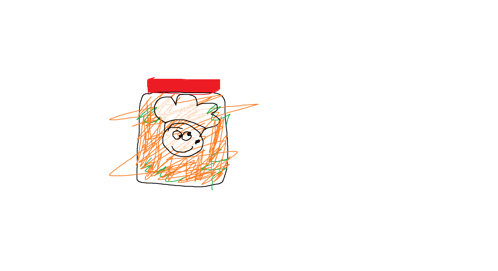
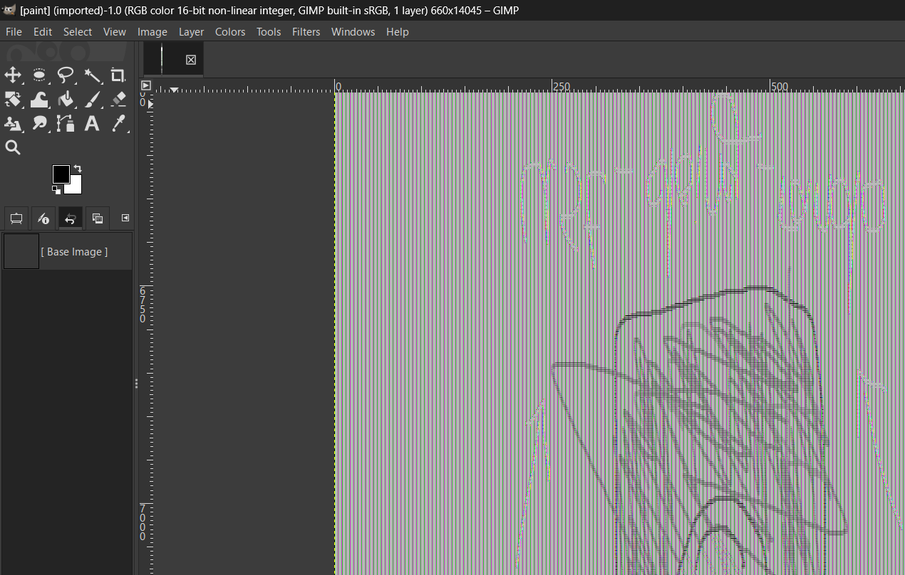
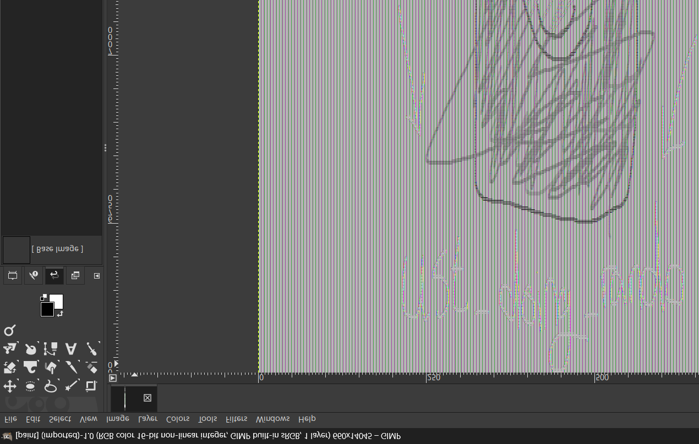
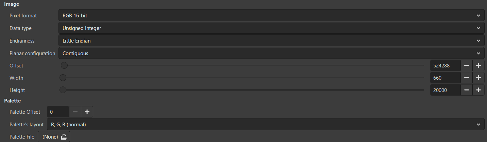
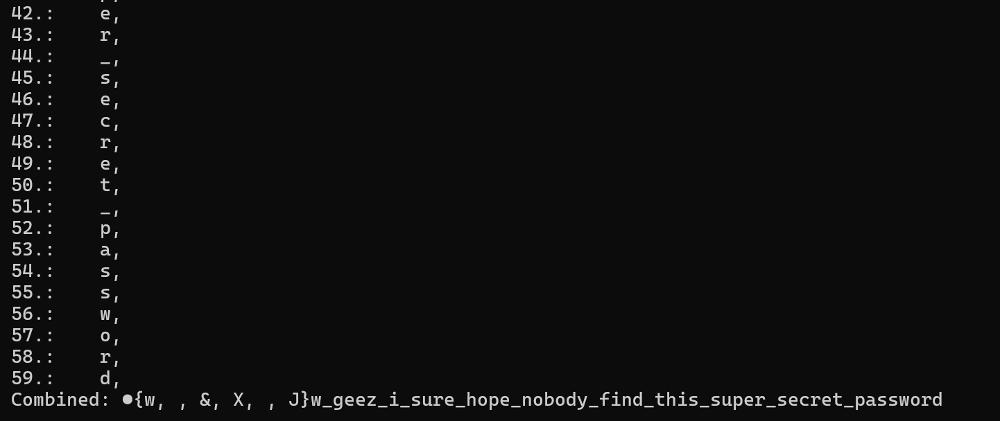
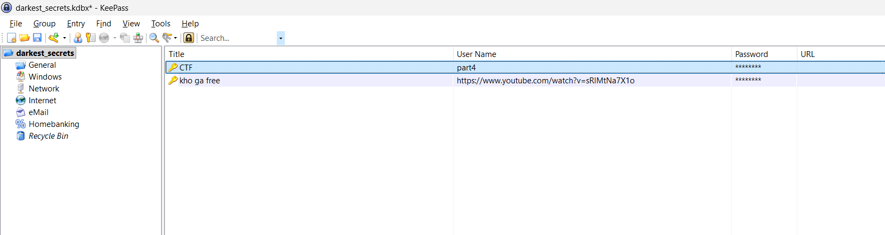
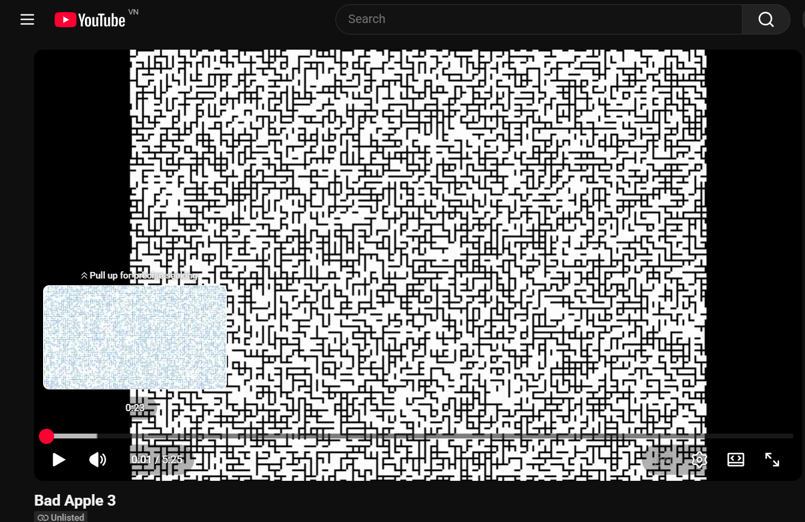
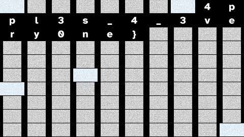

# HCMUS-CTF Qual 2026

## forensic

### Memeory (31 solves / 288 points)

#### Description

When was the last time you touch volatility? 4-part flag

Download: [https://drive.google.com/file/d/1N3no9SHocpkVK-9N92ZJAYdSJjnHU52/view?usp=sharing](https://drive.google.com/file/d/1N3no9SHocpkVK-9N92ZJAYdSJjnHU52/view?usp=sharing)

#### Attachment

`DESKTOP-1LI6VC6-20260522-105906.raw` and SHA256 for integrity.

#### Solution

We were proud that we were the first team to solve this challenge. Also, we did NOT used AI to solve this chall either.

A memory dump was given. Using `windows.pslist` plugin of Vol3 we spotted 3 interesting processes: Paint, KeePass and Remote Desktop Connection.

```
7472    5632    mspaint.exe     0xe2825e6980c0  6       -       1       False   2026-05-22 10:57:32.000000 UTC  N/A Disabled
2964    5632    KeePass.exe     0xe2825eaac300  12      -       1       False   2026-05-22 10:58:14.000000 UTC  N/A Disabled
6136    5632    mstsc.exe       0xe2825eab9300  21      -       1       False   2026-05-22 10:58:35.000000 UTC  N/A Disabled
```

#### 1st part of the flag:

In this challenge, I used MemProcFS with forensic mode enabled for a better understanding of the file system at the time of capturing.

The 1st part of the flag was in the desktop `C:\\Users\\obiwan\\Desktop\\flag1.txt` with the content of `HCMUS-CTF{d0nt_m1nd_me_j`

#### 2nd part of the flag:

Part 2 and 3 of the flag can be found with the information from [this blog](https://w00tsec.blogspot.com/2015/02/extracting-raw-pictures-from-memory.html)

In the Document folder `C:\\Users\\obiwan\\Documents` there were some files:

- `flag2.png`: Despite the name, no flag could be found there:



- `darkest_secrets.kdbx`: KeePass database
- `Default.rdp`: RDP config

`flag2.png` looked like it was drawn in Paint, but why there were no flag?

That was because the flag was not written to the disk yet, it was still in the memory of the process (unsaved data).

Also, the data was stored in a way that when loaded the memory to an raw image reader it can still be seen.

So I dumped the memory map of the Paint process and loaded it in GIMP, then adjusing width and height accordingly.



Noted that they're upside down because that's the way BMP's are stored. Flipping the image got us the 2nd part `ust_doing_rando`:



Used offset:



#### 3rd part of the flag:

Apply the same technique for RDP process and we get the 3rd part of the flag: `m_stuff_on_window_4n`.


Used offset:


#### Final part of the flag:

We still haven's used the KeePass database yet. Thinking of KeePass and memory, there might be the `CVE-2023-32784` which allows the recovery of the cleartext master password from a memory dump.

Testing the recovery with this CVE works with [this PoC](https://github.com/vdohney/keepass-password-dumper):



The 2nd letter can be `w`, `&` ,`X` or `J`. Since the next part is `w_geez_i_sure_hope_nobody_find_this_super_secret_password`, it could be `w` and the whole password was `aww_geez_i_sure_hope_nobody_find_this_super_secret_password` (guessed). You could extract the hash from the database and brute it with John but the guessed password worked anyway.

Inside the database there were 2 entries:



The first entry was:`part4`:`d_call_it_a_challenge_to_meet_kpi}` and the 2nd one was `https://www.youtube.com/watch?v=sRlMtNa7X1o`:`https://www.tiktok.com/@t49_53/video/7632022585827396884` (thanks for the kho ga btw)

Flag: `HCMUS-CTF{d0nt_m1nd_me_just_doing_random_stuff_on_window_4nd_call_it_a_challenge_to_meet_kpi}`

## misc

### Bad Apple 3 (19 solves / 384 points)

#### Description

iykyk

[https://www.youtube.com/watch?v=6p9iiLJX59w](https://www.youtube.com/watch?v=6p9iiLJX59w)

#### Attachment

None

#### Solution

The first part of the flag was hidden in the video’s YouTube storyboard, which is the preview image that appears when hovering over the timeline. The challenge used the same character-rendering technique as the main video to render the flag inside the storyboard frames.



After painfully looking at each image, the 1st part was `HCMUS-CTF{4ppl3_f0r_y0u_4ppl3_for_m3_n_`

The second part of the flag was also related to the storyboard metadata. By running command `yt-dlp --skip-download --write-info-json "<https://www.youtube.com/watch?v=6p9iiLJX59w>"` 
we can inspect the video metadata and discover an additional storyboard format, `sb3`:

```json
{"id": "6p9iiLJX59w", "title": "Bad Apple 3", "formats": [{"format_id": "sb3", "format_note": "storyboard", "ext": "mhtml", "protocol": "mhtml", "acodec": "none", "vcodec": "none", "url": "<https://i.ytimg.com/sb/6p9iiLJX59w/storyboard3_L0/default.jpg?sqp=-oaymwGhAUg48quKqQOYAYgBAZUBAAAEQpgBMqABPKgBBLIBQBANDBAVHyYtDg4PEhcrLCkPDhAVHyoyKQ8RFBgmPTgtERQeKjFLRzYVHCkuOUdNPyUuNz1HUlFFM0BCQ0xERkO6AUARERUjRENDQxETFi9DQ0NDFRYpQ0NDQ0MjL0NDQ0NDQ0RDQ0NDQ0JCQ0NDQ0NCQkJDQ0NDQkJCQkNDQ0JCQkJCovOX_wMGCKSfwdAG&sigh=rs$AOn4CLBpGBMlqxfczPkEWwawDhAQIhuIrw>", "width": 48, "height": 27, "fps": 0.3076923076923077, "rows": 10, "columns": 10, "fragments": [{"url": "<https://i.ytimg.com/sb/6p9iiLJX59w/storyboard3_L0/default.jpg?sqp=-oaymwGhAUg48quKqQOYAYgBAZUBAAAEQpgBMqABPKgBBLIBQBANDBAVHyYtDg4PEhcrLCkPDhAVHyoyKQ8RFBgmPTgtERQeKjFLRzYVHCkuOUdNPyUuNz1HUlFFM0BCQ0xERkO6AUARERUjRENDQxETFi9DQ0NDFRYpQ0NDQ0MjL0NDQ0NDQ0RDQ0NDQ0JCQ0NDQ0NCQkJDQ0NDQkJCQkNDQ0JCQkJCovOX_wMGCKSfwdAG&sigh=rs$AOn4CLBpGBMlqxfczPkEWwawDhAQIhuIrw>", "duration": 325.0}],...
```

This `sb3` entry points to a storyboard image hosted on `i.ytimg.com`. Opening the first URL from this storyboard entry directly in a browser reveals the second part of the flag`4ppl3s_4_3very0ne}`:



So the intended solve path was:

- Check the YouTube timeline preview/storyboard for hidden content.
- Use yt-dlp to dump the video metadata.
- Inspect the .info.json file for storyboard formats.
- Find the sb3 storyboard URL.
- Open the storyboard URL directly to reveal the second part of the flag.

Flag: `HCMUS-CTF{4ppl3_f0r_y0u_4ppl3_for_m3_n_4ppl3s_4_3very0ne}`